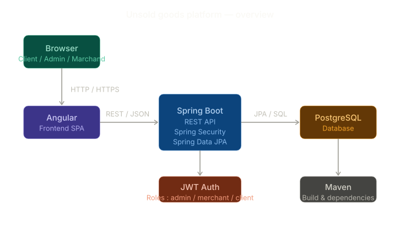

# Anti-gaspillage

## Introduction

### Table of content

* [Context](#context)
* [Stack tech](#stack-tech)
* [Running the application](#running-the-application)

### Context
Every day, restaurants, bakeries, and supermarkets throw away unsold food.
People try to save money or consume responsibly, which leads to enormous waste, lost money, and a negative environmental impact.

This web platform aims to allow retailers to publish their unsold items at the end of the day and offer discounted packs; and allows users to see offers near them and to reserve and collect the packs.

---

## Stack tech

* [Java 17](https://www.oracle.com/java/technologies/downloads/)
* Lombok
* Maven
* [PostgreSQL](https://www.postgresql.org/download/) [version 16.13](https://docs.postgresql.fr/16/)
* [Spring Boot version 4.0.5](https://start.spring.io/)

---

## Architecture

---

## Running the application

To run the application, please, go and read the following files:
* [running backend](antigasp/README.md).
* [running frontend](antigasp-frontend/README.md)

---

## Justifications for development

In these documents, i explain why some choices were made based in my logic and problems that i've encountered along the way.

You can find the explanations here:
* [for backend](documents/back-justifications.md).
* [for frontend](documents/front-justifications.md).

---

## Author

* **Name**: Gaspar da Rosa Francisco
* **Profession / Job**: Software engineer
* **(Personal) Email**: gaspardarosafrancisco@gmail.com
* **GitHub**: [Gasparfgf](https://github.com/Gasparfgf)
* **LinkedIn**: [Gaspar Francisco](https://www.linkedin.com/in/gaspar-francisco-gasparfgf/)
